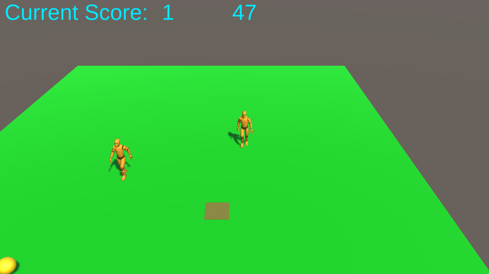

# FOFO_Dev

> Corra contra o tempo e contra o bot, colete moedas mais rápido que o inimigo, pontue e quebre seus recordes!

### Assets usados
Grid e pathfinding - https://arongranberg.com/astar/download

3d Model e animações - https://assetstore.unity.com/packages/3d/animations/basic-motions-free-154271#publisher

## Pré-requisitos
Se seu sistema operacional estiver entre Windows, Mac ou Linux, você pode executar o arquivo FOFO_Dev.exe dentro da pasta build.

## Metodologia
Foram usados dois patterns padrões no projeto. O primeiro deles é o MVC, consiste em dividir as funcionalidades em 3 subtipos de classe:
  
  ● Data: Go to application > model > ...
  
  ● Logic/Workflow: Go to application > controller > ...
  
  ● Rendering/Interface/Detection: Go to application > view > ..

O segundo pattern usado foi o "Object Pooling". Esse pattern consiste em não destruir objetos, mas sim, reutilizá-los no decorrer do game. Foi aplicado na moeda, evitando desperdícios de memória em destruição e criação de novos objetos.

## Gameplay settings
A cena principal do jogo é a cena "Main", ela está dividida em alguns componentes lógicos. irei fazer uma lista e especificar cada um e quais informações carregam:

● MVC

● Model: 

Em model temos dois objetos, um deles carrega dados de score como current score e high score. O segundo objeto carrega dados do game, como o tempo de partida.         Alterando esse tempo, você mudaria o tempo que o jogo ocorre. No padrão, começamos em 60 segundos.

● View:

Em view, outros dois objetos, um deles com as informações de interface do score/highscore e o segundo com as informações de timer, que servem para mostrar o           tempo de partida restante.

● Controller:

Em controller, também são dois objetos. O primeiro segue o padrão de informações sobre o score, porém ele tem as referências de model e view, além de dois             eventos públicos que são usados para adicionar pontos e atualizar o placar de highscore ao fim do jogo. O segundo objeto é o game controller, ele tem as               referências de game view e model, além de ter uma referência de score controller, o game controller é o controlador principal da partida, verifica tempo e             encerra o jogo quando necessário.

● System

O primeiro objeto filho de system é o mais importante e necessário a ser citado, ele é o nosso GRID, alterando variaveis nele podemos aumentar ou diminuir o            tamanho de nossa área jogavel. Os outros objetos são alguns padrões de cena como event system, Directional Light, main camera e cinemachine third person camera.

● Environment
   
  Temos 3 objetos em environment, o primeiro deles é a coin Parent, objeto pai da nossa moeda. Ele é um objeto vazio com finalidade de manter a moeda sempre em uma      posição padrão dentro dos nodes. Dentro dele temos a nossa moeda, ela tem um script de controller que carrega algumas informações como uma referência de                scoreController, limites de spawn position e uma referência do parent para reposicionarmos. 
  
  O segundo objeto é o cursor usado pelo player no jogo, ele é um cubo vazio, com um colisor e uma tag especifica de cursor. Tem a serventia de mostrar a                localização target e usar o colisor como trigger para avisar que o player chegou ao local desejado. 
  
  O terceiro objeto é o nosso ground, um cubo com a escala aumentada que serve de colisor para ativar os nodes walkables, funcionalidade do plugin de grid e            pathfinding citado lá no começo. 
      
● UI
    
UI carrega um objeto filho que é o nosso canvas, dentro do canvas temos um objeto que se chama endgame panel, dentro dele tem dois textos que são usados em             highscore. Os outros objetos filhos do canvas são current score text e timer text.
    
● Characters
      
Dentro de characters temos dois objetos principais, o player e o inimigo. Cada um deles tem um script characterController próprio, com préfixo referente ao tipo      do objeto. Ambos herdam de character controller, que tem algumas variáveis de referência como ai destination setter, ai path, animator controller e algumas            váriaveis exclusivas como referência da camera, do cursor, tempo de delay da busca e referência de coin para a busca.
      
Sendo esse o projeto, encerro este documento.
